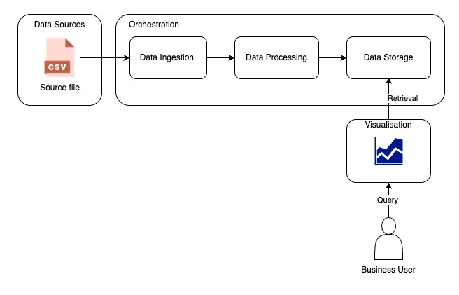

Power Plant Visualization

A full-stack application for visualizing the annual net generation of U.S. power plants based on EPA's eGRID 2023 dataset.

## Table of Contents
- [Getting Started](#getting-started)
  - [Prerequisites](#prerequisites)
  - [Setup and Installation](#setup-and-installation)
  - [Authentication Setup](#authentication-setup)
- [Usage](#usage)
- [Features](#features)
- [Architecture](#architecture)
- [Handling Changing Requirements](#handling-changing-requirements)
- [Monitoring](#monitoring)
- [Technology Choices](#technology-choices)

## Getting Started

### Prerequisites

- Docker and Docker Compose
- Git

### Setup and Installation

1. Clone the repository:
   ```bash
   git clone https://github.com/atsjbadhe/aiq-power-plant.git
   cd aiq-padministrationower-plant
   ```

2. Build and run the containers:
   ```bash
   docker-compose up -d
   ```

3. Access the application:
   - Frontend: http://localhost:3000
   - Backend API: http://localhost:8000
   - MinIO Console: http://localhost:9001 (login with minioadmin/minioadmin)

### Authentication Setup

The application uses [Clerk](https://clerk.dev/) for authentication. Follow these steps to set up authentication:

1. Create a Clerk account and a new application at https://dashboard.clerk.dev/
2. Configure your Clerk application:
   - Set up sign-in and sign-up methods
   - Configure the JWT settings in the JWT Templates section
   - Add your domain (e.g., localhost:5173 for development)

3. Set the following environment variables:
   - Frontend (.env file in the frontend directory):
     ```
     VITE_CLERK_PUBLISHABLE_KEY=your_clerk_publishable_key
     VITE_API_URL=http://localhost:8000
     ```
   
   - Backend (.env file in the backend directory):
     ```
     CLERK_PEM_PUBLIC_KEY=your_clerk_jwt_verification_key
     # OR
     CLERK_JWKS_URL=your_clerk_jwks_url
     FRONTEND_URL=http://localhost:5173
     ```

4. Restart the application:
   ```bash
   docker-compose down
   docker-compose up -d
   ```

## Usage

1. **Upload Data**:
   - Download the GEN23 sheet from the [EPA eGRID 2023 dataset](https://www.epa.gov/system/files/documents/2025-01/egrid2023_data_rev1.xlsx)
   - Save as CSV and upload using the application interface or via MinIO console

2. **Visualize Data**:
   - Select a state from the dropdown
   - Specify the number of top plants to view
   - Click "Visualize" to see the chart and data table

## Features

- **Data Ingestion**: Upload CSV files from EPA's eGRID dataset to S3-compatible storage
- **Data Visualization**: Interactive charts showing top power plants by net generation
- **Filtering**: Filter power plants by U.S. state
- **User Interface**: Simple User Interface
- **Authentication**: Secure user authentication via Clerk (social media authentication)
- **Comprehensive Logging**: Application logs, error logs, and audit logs for security and compliance

## Architecture

The application uses a simple three tier application. 

Find [Software Architecture Document](./wiki/Power-Plan-Visualization-‐-Architecture-Document)

### Conceptual Architecture



**Data Sources:** The process begins with raw data, exemplified by a "Source file" which is specifically identified as a CSV (Comma Separated Values) file. This indicates that the system primarily ingests structured, delimited data.

**Orchestration:** This central component represents the core data pipeline, handling the transformation and management of data. It consists of three sequential stages:

**Data Ingestion:** This stage is responsible for reading and taking in raw data from the specified data sources (e.g., the CSV file).
**Data Processing:** After ingestion, the raw data undergoes various transformations, cleaning, aggregation, or enrichment processes to make it suitable for analysis and storage.
**Data Storage:** The processed data is then persisted in a storage mechanism, making it available for retrieval and further use.
**Visualisation:** This component is responsible for presenting the processed data in a human-understandable format, likely through charts, graphs, dashboards, or reports, as suggested by the visualization icon. It retrieves data from "Data Storage" to create these visualizations.

Business User: The ultimate consumer of the system's output is the "Business User." They interact with the "Visualisation" component by sending "Query" requests to obtain insights from the processed data. The visualization component, in turn, performs "Retrieval" from the "Data Storage" to fulfill these queries.

In essence, the system conceptually takes raw data, processes it through a defined pipeline, stores it, and then allows business users to query and visualize this processed data to gain insights. It highlights the logical separation of concerns within the data flow

### Logical Architecture

```
┌─────────────┐      ┌─────────────┐      ┌─────────────┐
│             │      │             │      │             │
│   Frontend  │◄────►│   Backend   │◄────►│  Object     │
│   (React)   │      │   (FastAPI) │      │  Storage    │
│             │      │             │      │  (MinIO/S3) │
└─────────────┘      └─────────────┘      └─────────────┘
```

### Deployment Architecture

```
┌─────────────────────────────────────────────────────┐
│                  Docker Compose                     │
│                                                     │
│  ┌───────────┐   ┌───────────┐   ┌───────────┐     │
│  │  Frontend │   │  Backend  │   │   MinIO   │     │
│  │  Container│   │  Container│   │  Container│     │
│  └───────────┘   └───────────┘   └───────────┘     │
│                                                     │
└─────────────────────────────────────────────────────┘
```

### Infrastructure Architecture

- **Frontend**: React with TypeScript, Vite, Material UI, and Recharts
- **Backend**: Python FastAPI with pandas for data processing
- **Storage**: MinIO (S3-compatible object storage)
- **Containerization**: Docker with docker-compose for orchestration


## Handling Changing Requirements

The application is designed to be adaptable to changing requirements:

### Scaling for Larger Datasets
- **Distributed Processing**: Could implement Apache Spark for larger datasets
- **Database Integration**: Could migrate from file-based storage to a database like PostgreSQL
- **Caching**: Already implements in-memory caching, could add Redis for distributed caching

### High Availability
- **Load Balancing**: Could deploy with multiple backend instances behind a load balancer
- **Clustering**: Could implement container orchestration with Kubernetes
- **Database Replication**: Could implement master-slave replication for the database

### Enhanced Security
- **JWT Authentication**: Could add user authentication and authorization
- **Role-Based Access Control**: Could implement different permission levels
- **Data Encryption**: Could encrypt sensitive data at rest and in transit

## Monitoring

The application could be monitored using the following strategies:

### Application Monitoring
- **Prometheus and Grafana**: For metrics collection and visualization
- **Logging**: Centralized logging with ELK stack (Elasticsearch, Logstash, Kibana)
  - **Application Logs**: General application logs in `logs/app.log`
  - **Error Logs**: Detailed error tracking in `logs/error.log`
  - **Audit Logs**: Security and compliance audit trail in `logs/audit.log`
- **Tracing**: Distributed tracing with Jaeger or Zipkin

### Infrastructure Monitoring
- **Container Health**: Docker container health checks and resource utilization
- **Host Metrics**: CPU, memory, disk, and network monitoring
- **Alert Management**: Alerting with Alertmanager or PagerDuty

### Business Metrics
- **User Activity**: Monitor user interactions and feature usage
- **Data Processing**: Track data processing times and volumes
- **API Performance**: Monitor API response times and error rates

## Technology Choices

### Frontend
- **React**: For building interactive user interfaces
- **TypeScript**: For type safety and better developer experience
- **Material UI**: For consistent and responsive design components
- **Recharts**: For data visualization with charts
- **Vite**: For faster development and optimized builds

### Backend
- **FastAPI**: For high-performance, async-capable API development
- **Pandas**: For efficient data processing and analysis
- **Boto3/MinIO**: For S3-compatible object storage interaction
- **Pydantic**: For data validation and settings management

### Infrastructure
- **Docker**: For containerization and consistent environments
- **Docker Compose**: For multi-container application orchestration
- **MinIO**: For S3-compatible object storage
- **Nginx**: For serving static files and API routing
